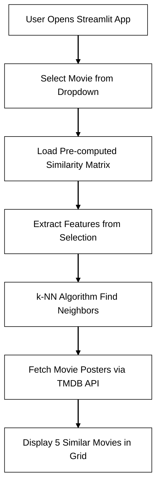

# 🎥 Movie Recommendation System using Machine Learning

---

## 📌 Project Overview

Welcome to the **Movie Recommendation System**, a smart application built with **Machine Learning**, **Python**, and **Streamlit**! This project delivers personalized movie suggestions using **content-based filtering**, leveraging movie overviews and genres. By employing **cosine similarity**, it identifies and recommends movies that align with your preferences, complete with vibrant poster previews fetched via the **TMDB API**.

---

## 🎥 Live Demo

Experience the system in action!  
👉 **[Watch the Demo Video](https://drive.google.com/file/d/1WNSKXbmn5a-7CR3hFn33XDZuAj45bQbS/view?usp=sharing)**

---

## ✅ Key Functionalities

- 🔍 **Content-Based Filtering**: Recommends movies based on overviews and genres.
- 📦 **Large Dataset**: Utilizes a preprocessed dataset of over 5,000 movies from TMDB.
- 📑 **Cosine Similarity**: Computes similarity scores for accurate recommendations.
- 🎨 **Interactive UI**: Built with Streamlit for a seamless user experience.
- 🎞️ **Movie Posters**: Fetches vibrant posters using the TMDB API.

---

## 📊 Dataset

The project is powered by the **[TMDB 5000 Movie Dataset](https://www.kaggle.com/datasets/tmdb/tmdb-movie-metadata)** from Kaggle, containing rich metadata for thousands of movies.

---

## 🔧 Tools & Technologies

| **Tool**          | **Purpose**                                      |
|-------------------|--------------------------------------------------|
| 🐍 **Python**     | Core programming language                        |
| 📊 **Pandas**     | Data handling and manipulation                   |
| 🤖 **Scikit-learn** | Cosine similarity computation                  |
| 💾 **Pickle**     | Saving machine learning model artifacts          |
| 🌐 **Streamlit**  | Frontend framework for interactive web UI       |
| 🎬 **TMDB API**   | Fetches movie posters and metadata              |

---

## 🧠 How It Works

The Movie Recommendation System follows a streamlined pipeline to deliver personalized movie suggestions. Below is the process visualized in a flowchart:



## 📁 Project Structure

```bash
Movie-Recommendation/
├── main.py                     # Streamlit app
├── MOVIE RECOMMENDER SYSTEM.ipynb  # Jupyter notebook Code
├── movie_list.pkl              # Pickle file of movie names and similarity matrix
├── test_poster_fetch.py        # Poster-fetch testing script
├── tmdb_5000_movies.csv        # Dataset
├── README.md                   # Project documentation

```


## 🙋‍♀️ Author

**Shivangi**  
_Data Science & Analytics Enthusiast_  
[GitHub Profile](https://github.com/vaish-shivangi)


